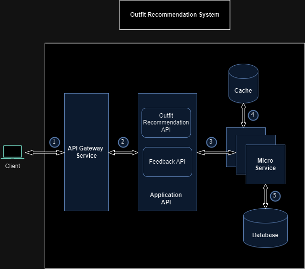
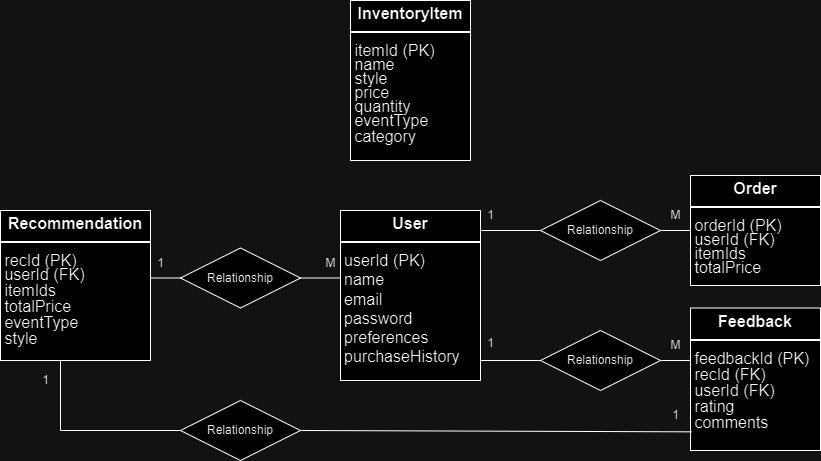

# Outfit Recommendation Service

## Project Description

This project is a backend service for an outfit recommendation tool. The service suggests outfits based on user inputs, such as event type, preferences, and available inventory. The tool aims to enhance user shopping experience by providing personalized wardrobe suggestions.

## Features

- User input handling for event type and preferences.
- Inventory filtering based on user inputs.
- Outfit recommendation generation.
- Feedback collection for recommendations.
- Clean, well-documented code with extensible design.

## Architecture Overview



## Entity-Relationship Diagram (ERD)



## Technologies Used

- Java
- Spring Boot
- Gradle
- In-memory data structures (for inventory management)
- RESTful APIs

## Getting Started

### Prerequisites

- Java 21 or higher
- Gradle 8.8 or higher

### Installation

1. Clone the repository:
    ```sh
    git clone https://github.com/kushvaharavi/outfit-recommendation.git
    cd outfit-recommendation
    ```

2. Build the project using Gradle:
    ```sh
    ./gradlew build
    ```

### Running the Application

You can run the application using the following command:

```sh
./gradlew bootRun

API Endpoints
POST /recommendations

This endpoint accepts user input and returns a list of outfit recommendations.

Request:
{
    "eventType": "BIRTHDAY",
    "budget": 1100.0,
    "style": "CASUAL"
}

Response:
[
    {
        "items": [
            {
                "id": 8,
                "name": "Jeans",
                "style": "CASUAL",
                "price": 600.0,
                "stockQuantity": 15,
                "eventType": "BIRTHDAY",
                "category": "TROUSERS"
            },
            {
                "id": 20,
                "name": "Birthday Crown",
                "style": "CASUAL",
                "price": 150.0,
                "stockQuantity": 20,
                "eventType": "BIRTHDAY",
                "category": "ACCESSORY"
            }
        ]
    }
]
